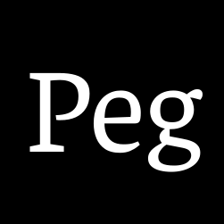
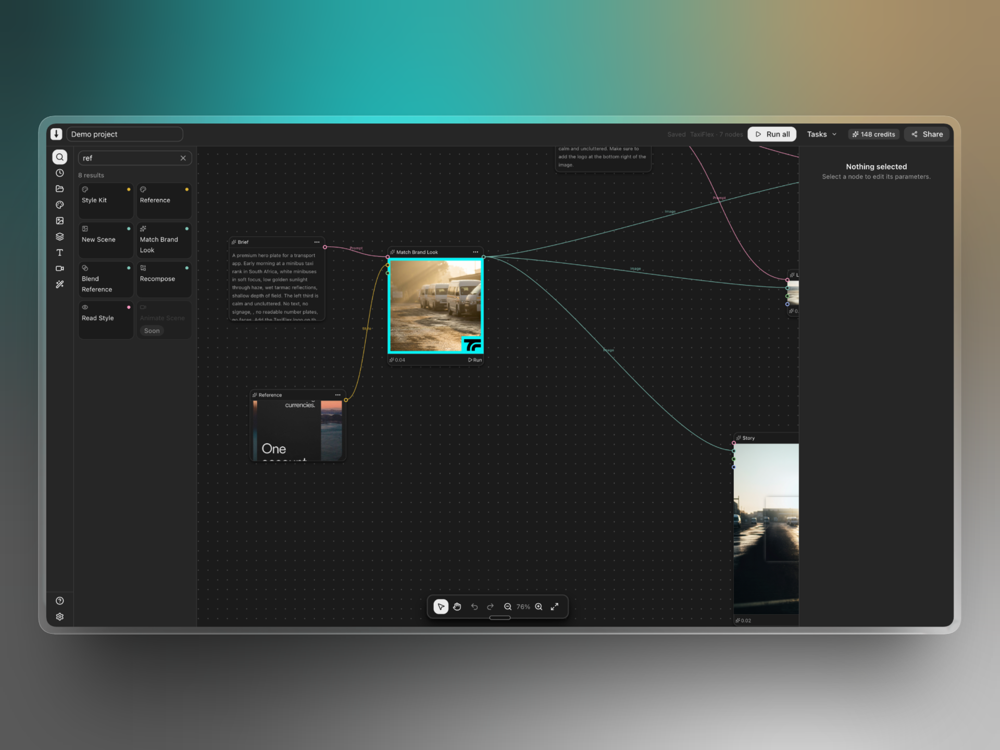
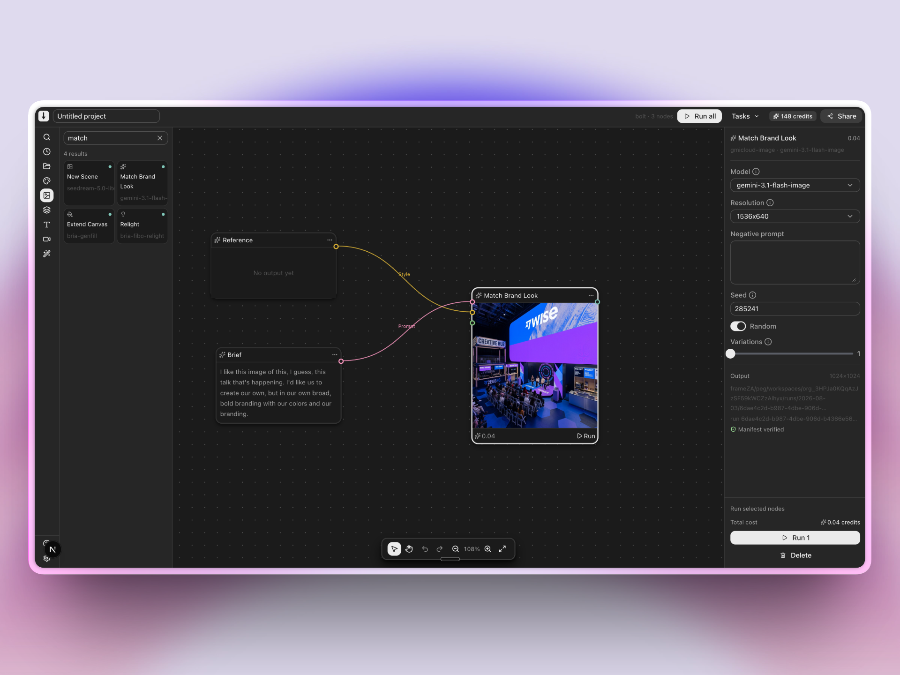
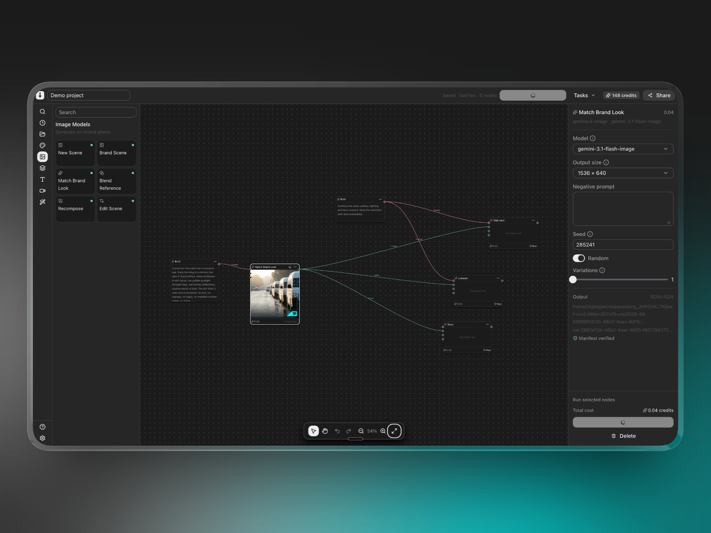
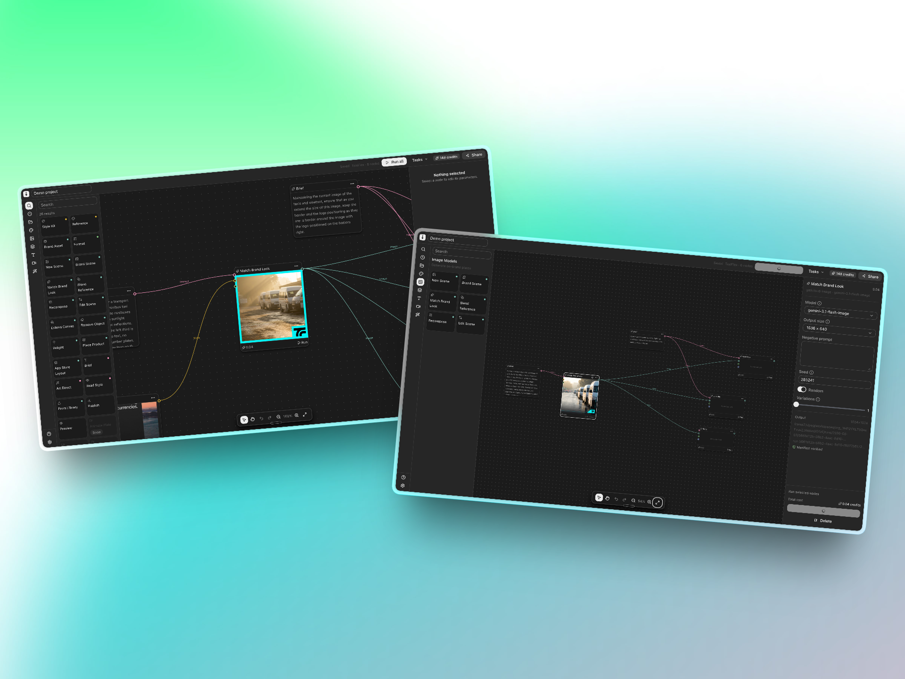

<div align="center">



# PEG

**Brand-locked key visuals, composed for every breakpoint.**

A node canvas where a brand defines its look once, and any campaign brief produces a finished hero plate that holds that look — composed correctly for whatever canvas it has to fill, rather than cropped down to it.

`Next.js 16` · `React 19` · `TypeScript 6` · `FastAPI` · `Genblaze` · `Backblaze B2` · `Clerk`

*Work in progress. Built in three days for the Backblaze Generative AI Media Hackathon.*

</div>

---

## Contents

- [The problem](#the-problem)
- [The thesis: compose, don't crop](#the-thesis-compose-dont-crop)
- [What it looks like](#what-it-looks-like)
- [Who it's for](#who-its-for)
- [How it works](#how-it-works)
- [The technical heart: the expansion recipe](#the-technical-heart-the-expansion-recipe)
- [Design engineering notes](#design-engineering-notes)
- [Running it locally](#running-it-locally)
- [Testing](#testing)
- [What's proven vs. what isn't](#whats-proven-vs-what-isnt)
- [Known weaknesses](#known-weaknesses)
- [What's still to build](#whats-still-to-build)
- [Hackathon context](#hackathon-context)
- [Project structure](#project-structure)

---

## The problem

A corporate marketing team needs the same campaign hero in a dozen places: a desktop web banner, a mobile app header, an Instagram story, a LinkedIn card, an App Store screenshot. Today that means either commissioning an agency for each one, or shooting one image and cropping it N ways.

Cropping is what every DAM, Cloudinary, and imgix already does well — and it's precisely why a desktop hero looks wrong on a 14" laptop. **A single composition cannot serve every aspect ratio.** Crop a 16:9 hero to 9:16 and the product falls out of frame, or the headline lands on top of it.

The spend PEG goes after is the expensive half: 3D product renders, brand photography libraries, and per-format art direction. Not cropping, which is cheap and solved.

## The thesis: compose, don't crop

PEG generates a *different composition* per breakpoint from the same brand lock.

- Desktop gets the product right-of-centre, with the left third kept visually calm for a headline.
- Mobile gets it stacked, with room at the top.
- Same brand, same lighting, same palette — **composed for each canvas, not cropped into it.**

That's the product idea in one line, and it drives every architectural decision below.

### The rule underneath it

An earlier version of this project's notes said "diffusion cannot render your product, don't try." **That turned out to be wrong, and testing disproved it.** `gemini-3.1-flash-lite-image` renders exact wordmarks crisply and correctly spelled, including inside reflections.

The accurate rule is narrower, and it's the one PEG is built on:

> **Don't expect a model to conjure a brand asset it has never seen.**
> Asking for "the Discovery Bank logo" gets you an approximation. *Specifying* text, or *supplying* the asset, works.

So there are two valid paths, chosen per element:

| Path | When to use it | How |
|---|---|---|
| **Composite** the real cutout | The hero product, anything needing legal or brand sign-off, exact marks (card numbers, wordmarks) | `Brand Asset` → `Place Product`, executed locally |
| **Generate** it | Secondary presence — product in a reflection, at an angle, distant, relit to match the plate | A Gemini image model, with the text specified |

Compositing stays the default for the hero product on **compliance** grounds, not technical ones: "very close" is a brand failure when a team signs off pixel-exact assets. But generation is no longer off the table, and it does things a flat PNG composite can't — angles, reflections, matched relighting.

---

## What it looks like

> **Note on scope:** the canvas editor is the surface shown here. The project gallery, brand kit, and workspace views are built and functional, but are getting a craft pass before capture — see [What's still to build](#whats-still-to-build).

### The canvas editor

The core surface. A searchable node palette on the left, an infinite pan-and-zoom canvas in the middle, and a parameter inspector on the right. Node names describe *jobs* — "Match Brand Look" — with the model ID rendered underneath as reference detail.



### Reference in, on-brand plate out

The `Reference` node takes the look you want recreated — a competitor hero, a Pinterest pin, an old campaign — and feeds it into generation as a style input. The `Brief` node carries the campaign copy. The inspector shows the resolved model, output size, seed, and the B2 object key with its manifest verification state.



### Breakpoint fan-out

One brief, one plate, several breakpoints. Each downstream node is a different target canvas driven from the same brand lock and the same source image — the fan-out that makes the "compose, don't crop" claim concrete.



### Two projects side by side



---

## Who it's for

**Corporate marketing and brand teams** who currently commission agencies for key visuals, and the in-house designers who have to produce twelve versions of one campaign.

The design constraints that follow from that audience:

- **A workspace is a real organisation.** Auth is Clerk, and a workspace is a Clerk organization. Everything a workspace owns lives under its own storage prefix, which is what makes a fresh sign-in a genuinely empty state rather than a seeded demo.
- **Editing the brand kit is an admin act.** Members read it; admins change it. Every generation is locked to it, so it isn't something an individual should be able to quietly redefine.
- **The brand kit asks for artwork, not prose.** Marketing teams have logos, screenshots, and reference images. They don't have a written description of their own lighting. (This one created a real problem — see [Known weaknesses](#known-weaknesses).)
- **Typography is captured as a classification, not a typeface.** No model can render "Founders Grotesk", and a marketing team shouldn't have to look it up.

---

## How it works

### Architecture

Two deployed services, because Genblaze is Python-only and a single run takes minutes — well past any serverless timeout.

```
┌─────────────────────────────────────────────────────────┐
│  peg-web  ·  Next.js 16 (App Router, Turbopack)         │
│                                                          │
│  React canvas editor ──► route handlers ──► proxy        │
│  Clerk session ──► resolves workspace ──► X-PEG-Workspace│
└────────────────────────┬─────────────────────────────────┘
                         │  HTTP + X-PEG-Token
┌────────────────────────▼─────────────────────────────────┐
│  peg-service  ·  FastAPI + Genblaze (Python 3.11)        │
│                                                          │
│  POST /runs      ──► {run_id, status: queued}  (returns  │
│  GET  /runs/{id} ──► {status, asset?, provenance?}  now) │
│  POST /enhance   ──► answers directly (one text call)    │
└────────┬──────────────────────┬──────────────────────────┘
         │                      │
   ┌─────▼──────┐        ┌──────▼─────────┐
   │  GMI Cloud │        │  Bria direct   │
   │  (images)  │        │  (expand v2)   │
   └─────┬──────┘        └──────┬─────────┘
         └────────┬─────────────┘
            ┌─────▼──────────────────┐
            │  Backblaze B2          │
            │  assets + signed       │
            │  provenance manifests  │
            └────────────────────────┘
```

Generation is **submit-then-poll**, not request-response. `POST /runs` returns a job id immediately and the browser polls. The one exception is `/enhance` — rewriting a rough brief into art direction is a single text call of a few seconds, and making someone poll for a paragraph would be the slower experience.

### The graph

A canvas is a directed graph of typed nodes. Ports carry a media type (`text`, `image`, `video`, `audio`, `mask`) plus two that aren't media at all:

- **`style`** — a brand constraint. A locked look.
- **`format`** — a breakpoint's geometry: dimensions, safe area, focal point.

Those two are the whole product in the type system. A `format` edge is how one `Format` node drives an entire fan-out; a `style` edge is how the brand lock reaches every generator.

Execution is planned client-side (`lib/graph-execution.ts`): a topological order over the runnable subset, so a shared plate runs once before both branches that consume it. Dependencies *outside* the selection are deliberately ignored — running one branch is allowed to consume an already-produced result upstream. Cycles are rejected before anything is spent.

### The node catalog

**26 nodes; 19 live, 7 badged `coming-soon`.** A node is `live` only if it maps to a model verified against a real API call, or to a local operation. Everything else is either visible-but-disabled (to show the roadmap) or absent entirely.

Cut during the executable-set pass, and staying cut: dead providers, LoRA/fine-tune nodes (Genblaze has no such concept), segmentation nodes (masks can be *consumed* but never *generated* — no SAM, no grounding-dino), and the whole local editing suite (levels, blur, invert, channels, crop, resize).

Video and audio nodes are held back on cost and validation time, not capability.

---

## The technical heart: the expansion recipe

This is the part I'd point at in an interview, so it gets its own section.

**Reaching a breakpoint is the entire product, and the obvious implementation is wrong.**

### The constraint

`seedream-5.0-lite` **ignores** `resolution`, `aspect_ratio`, `width`, and `height`. The SDK verifiably sends all four; the API returns 2048×2048 regardless. Every image model here returns its own fixed size and none honour dimension params. So hitting an exact 1920×600 canvas has to happen *after* generation.

### The wrong version (built, tested, thrown away)

Paste the plate onto a target-sized canvas, paint a feathered mask over the empty region, ask `bria-genfill` to fill it.

It produces the right dimensions. For a narrow margin it even looks fine. Given a large empty region it fails in a specific, repeatable way: **genfill invents a second, separate scene beside the source** rather than continuing the original one.

The reason is worth stating plainly, because it's the kind of thing that only shows up when you actually run it: a masked fill is only ever told *"put something plausible here."* Nothing in that request says the new pixels are the **same photograph** as the kept ones.

### The right version

Bria's `/v2/image/edit/expand` is the purpose-built operation. It takes explicit geometry instead of a mask:

| Field | Meaning |
|---|---|
| `image` | the source, base64, at exactly its rendered size |
| `canvas_size` | `[w, h]` of the result |
| `original_image_size` | `[w, h]` the source occupies within that result |
| `original_image_location` | `[x, y]` of its top-left corner |

The pipeline, in five steps:

1. **Generate** the plate normally. Any size; 2048² is fine.
2. **`prepare_expand`** detects a flattened brand frame, peels it off, scales the scene to fit the inner canvas, and chooses a placement that keeps the source **out of the copy-safe band**.
3. **`run_outpaint` refuses the job** if the safe area still overlaps protected source pixels, or if the target doesn't actually extend the source. Both are cheaper as errors than as a bad paid render.
4. **`BriaExpandProvider`** submits, polls, and downloads. The POST is paid and unsafe to repeat, so a 5xx or transport failure on it raises a deliberately **non-retryable** error; only the GETs retry.
5. **`finalize_expand`** pastes the original source pixels back over the model's output (feathered ~4px at the seam) and rebuilds the outer frame and corner lockup locally.

**Step 5 is the whole point.** The model is never asked to reproduce anything we already have. It supplies only newly revealed scene; every protected pixel is restored deterministically, so brand chrome cannot drift.

> **Verified live end-to-end:** a 2048² plate → **exactly 1920×600**, one continuous photograph with the subject held right and a calm left third for a headline. No second scene, no duplicated subject, no inset frame. The seam where restored source meets generated pixels measures a column delta of ~1.8 against a ~1.2 baseline in flat areas — below the image's own noise floor, and invisible at 3× zoom.

### The safe area has to sit on the axis the target actually frees

This is the subtlest bug in the project, and it only became visible once portrait presets were tried.

Extend Canvas *contains* the whole source rather than cropping it. That has a consequence:

- A source at least as wide as it is tall, contained in a **portrait** target, scales to the target's full **width**. It spans the canvas edge to edge — so a `left-third` band is entirely preserved pixels, and **no placement can avoid it**.
- The same source in a **landscape** target scales to full **height** and leaves horizontal room, so `left-third` works fine and `upper-third` doesn't.

A fixed `Left third` default therefore guaranteed a failed run on *every* portrait preset. `safeAreaForTarget` now moves the band when the target changes — but only ever moves one that cannot work, and never touches `Center`.

Whether a *remaining* overlap is acceptable depends on what else was available, not on the raw number:

| Situation | Behaviour |
|---|---|
| No overlap | runs |
| Another band clears the source completely | **refused**, naming that band |
| Nothing clears, ≤ 50% overlap | runs, **with a warning** |
| Nothing clears, > 50% | refused |

Row two is the one that matters: if a clean alternative exists, the chosen band is a silent downgrade, so it's refused rather than warned. Row three exists because a fully clear band is unreachable whenever the target's aspect ratio is close to the source's — 1:1 into 4:5 frees less new height than a third of the canvas — and refusing those made the entire Instagram-portrait preset unusable.

**Warnings ride on a *successful* outcome.** A run that produced a real asset must never be reported as failed.

### Reliability, as measured

GMI **drops connections frequently** at this payload size. Across 7 submits: `Connection reset by peer`, `Server disconnected without sending a response` (×3), and one `BrokenPipeError` mid-transfer that made Genblaze discard the manifest too. Roughly **1 in 3 submits succeeds.**

Shrinking the payload (PNG → JPEG q92, 308KB → 109KB base64) did **not** fix it. Retry with backoff is mandatory; 3 attempts was enough every time. A failed asset transfer is treated as a failed run.

Two more hard-won details, both now guarded by tests:

- **`request_id` in a Bria status body is not the job id.** Bria mints a fresh one on every status GET — three calls against one finished job returned three different ids, none of them the job's. An early version treated it as a correlation check and rejected a job that had actually completed. Correlation comes from the status URL, which is constructed locally.
- **Bria's returned `status_url` is never followed.** It's validated for protocol drift and then discarded; the canonical endpoint is rebuilt from the request id. Output URLs are checked against an allowlist of Bria delivery hosts before any download.

---

## Design engineering notes

The decisions below sit at the seam between interface and infrastructure — where a product choice and an engineering constraint are the same decision.

### Where the design system ends and custom code begins

Everything that can be the design system is the design system: panels, toolbars, inputs, cards, text. The rule is *never hand-roll what already exists* — check a component's real props before using it rather than guessing.

**The canvas layer is the one deliberate exception.** Node positioning, SVG bezier edges, and the pan/zoom transform are raw DOM, because no design system ships a graph primitive. That layer still pulls every colour, radius, and shadow from design tokens, so it stays visually native to the rest of the app.

Drawing that boundary explicitly is what keeps custom code from creeping outward: one named exception with a stated reason, rather than a gradual drift into bespoke CSS.

### Decisions worth defending

- **Node names are jobs, not models.** "Match Brand Look", not "FLUX Kontext". The model ID renders underneath as reference detail. A marketing team should never have to learn a model name to use the tool, but a technical user shouldn't have to guess what's running either.
- **The canvas states its own target, but a connected `Format` node wins.** Extend Canvas has its own target-size parameter for the common case of taking one plate wider without wiring anything up. Connect a Format node and it takes over — which is the right tool for a fan-out, where several breakpoints are driven from one place. Progressive disclosure, applied to a graph.
- **Refuse bad runs before spending money.** Three separate guards (safe-area overlap, target-doesn't-extend-source, dependency cycles) all exist to turn a bad paid render into a free error message. Every one of them was written after watching money get spent on an unusable output.
- **Auth is checked at the resource, never in the proxy.** Pages call `requireOrganization()`; route handlers resolve the workspace themselves. A route matcher can drift from how the framework actually routes a request, and that failure mode is a protected resource silently becoming reachable.
- **Empty states are real, not simulated.** There's no first-run mode, no seeding, no reset anywhere — just a storage prefix with nothing under it. A fresh workspace's gallery is empty because its storage is empty.

### Approaches that were replaced

Four implementations were built, tested against the live API, and thrown out. Each is documented here because the replacement only makes sense against what it replaced — and because the failure modes are specific enough to be worth knowing before touching this code.

| Original approach | Why it failed | What replaced it |
|---|---|---|
| Masked genfill for canvas extension | A masked fill is never told the new pixels are the *same photograph* — it invents a second scene beside the source | A dedicated expand endpoint with explicit geometry, plus local restoration of every protected pixel |
| A fixed `Left third` safe-area default | Guaranteed a failed run on every portrait preset, because a contained source spans a portrait canvas edge to edge | `safeAreaForTarget`, which moves the band onto the axis the target actually frees |
| Correlating Bria jobs on `request_id` | Bria mints a fresh id per status call, so this rejected jobs that had genuinely completed | Correlation via the locally-constructed status URL |
| "Diffusion cannot render your product" as a blanket rule | Untrue for current models, and it foreclosed a capability the product wants | A narrower, testable rule: don't expect a model to conjure an asset it has never seen |

All four shared one cause — a plausible mental model of the upstream standing in for a measurement of it — and all four surfaced the same way, by running the pipeline live and inspecting what came back. That is why [output validation](#output-validation--the-primary-open-workstream) is treated as a first-class workstream here rather than a QA afterthought, and why each of these now carries a regression test.

---

## Running it locally

### Prerequisites

- **Node 24+** and **Python 3.11**
- **TypeScript 6** specifically — *not* 7, which doesn't expose the compiler API Next.js needs
- Accounts: GMI Cloud, Backblaze B2, Clerk. Bria is optional (only Extend Canvas needs it).

### Setup

```bash
git clone <repo> && cd peg2
npm install
```

```bash
python3.11 -m venv service/.venv && service/.venv/bin/pip install -r service/requirements.txt
```

```bash
cp .env.example .env.local
```

Then fill in `.env.local`. It's gitignored; `.env.example` is committed and must never hold a real secret. Required: `GMI_API_KEY`, the four `B2_*` variables, and the Clerk pair. Optional: `BRIA_API_TOKEN` (Extend Canvas only — the service boots without it and fails just that node with a scoped configuration error).

**Enable Organizations in the Clerk dashboard.** A workspace *is* a Clerk org, and the brand kit belongs to it. Without organizations enabled, `requireOrganization()` has nowhere to send anyone.

### Run

Two processes. The Python service first:

```bash
service/.venv/bin/uvicorn main:app --app-dir service --port 8010 --reload
```

Then the web app:

```bash
npm run dev
```

### Verify the wiring

```bash
service/.venv/bin/python service/check_env.py
```

This checks credentials and performs a live auth call. If a deploy or a local run misbehaves, `GET /api/health` on the app reports the resolved service address *and* whether the upstream answers — worth hitting first, because a misconfigured URL and a dead service otherwise look identical ("fetch failed").

---

## Testing

Three tiers, deliberately separated by what they cost.

### Tier 1 — unit tests (free, no credentials, no network)

```bash
npm test
```

Runs both suites: **31 web tests** (`node --test`) and **113 service tests** (`unittest`) — **144 total**, in about 4.5 seconds. These need no API keys and spend nothing. They must pass before anything is considered done.

Individually:

```bash
npm run test:web
```

```bash
npm run test:service
```

**What's covered.** The web tests cover the pure logic that would be expensive to get wrong: dependency ordering and cycle rejection (`graph-execution`), safe-area reassignment per target (`formats`), node placement, brief-context resolution, and workflow-draft recovery — including that a browser recovery draft cannot cross a workspace boundary.

The service tests cover the parts that touch money and provenance: expand geometry, the outpaint guards, manifest verification, brand palette extraction, reference conditioning, workspace scoping, and run listing. Several encode bugs that actually happened — the Bria `request_id` correlation trap has a test whose only job is to stop it being reintroduced.

### Tier 2 — static verification (free)

```bash
npm run typecheck
```

```bash
npm run build
```

Both currently pass clean. **Run both before declaring any work done** — the build catches server/client boundary violations that `tsc` alone won't, and those fail at runtime rather than compile time.

### Tier 3 — live smoke tests (⚠️ these cost real money)

Never run these in a loop, and never in CI.

```bash
service/.venv/bin/python service/smoke_test.py
```
Generate → upload to B2 → write and verify a manifest. Proves the whole chain.

```bash
service/.venv/bin/python service/expand_test.py
```
Square plate → exactly 1920×600. **Paid.** This is the test that proved the expansion recipe and disproved the genfill one.

```bash
service/.venv/bin/python service/nano_banana_test.py
```
Verifies exact wordmark rendering.

### Testing rules

1. **Unit tests must not require credentials or spend anything.** If a test needs a key, it belongs in tier 3.
2. **A bug that reached a live run gets a regression test.** No exceptions — that's how the `request_id` trap, the second-scene failure, and the portrait safe-area bug are all prevented from returning.
3. **A run that produced an asset is never reported as failed.** Warnings ride on success. There's a test for this specifically, because getting it wrong makes the product feel broken when it worked.
4. **Guards are cheaper than renders.** Anything that can be refused locally before a paid submit should be, and should have a test proving it refuses.
5. **Assert an asset actually landed.** `Pipeline.run()` swallows step failures and returns `status: completed` even when nothing was produced. Always pass `raise_on_failure=True`, and always check.
6. **Warm the service before demoing.** The free tier idles both services after ~15 minutes, and a cold start is 50s+ *per service*.

---

## What's proven vs. what isn't

Being precise about this matters more than the feature list. Everything below was checked against the installed SDK and live API calls.

"Confirmed" here means the *mechanism* is verified — the call succeeds, the dimensions are right, the asset lands, the manifest verifies. Whether the returned image is on-brief is a separate question, tracked under [output validation](#output-validation--the-primary-open-workstream).

### Confirmed working end to end

| Model | Role | Output | Evidence |
|---|---|---|---|
| `seedream-5.0-lite` | text-to-image plate | 2048×2048 | `smoke_test.py` |
| `gemini-3.1-flash-lite-image` | text-to-image with **accurate text** | 1024×1024 | `nano_banana_test.py` — worked first try |
| `bria-expand-v2` | canvas expansion to a breakpoint | exactly the requested canvas | `expand_test.py` — verified 2048² → 1920×600 |
| `google/gemini-3.5-flash-lite` | brief → art direction | 3.8s, 0 reasoning tokens | benchmarked against four alternatives |

The brief enhancer needs no second credential: GMI also serves ~80 LLMs on an OpenAI-compatible endpoint. `GEMINI_API_KEY` is declared in the env template but is **empty and unused**.

### Known dead or gated

| Model | Status |
|---|---|
| `reve-remix-20250915` | **dead** — upstream probe returns not_found |
| `seededit-3-0-i2i-250628` | **entitlement-gated** — probes healthy, real submits 404 "no access" |
| `flux-kontext-pro`, `bria-fibo-image-blend`, `bria-fibo-relight` | unregistered, untested |

### Things that don't exist, despite documentation suggesting otherwise

- **No LoRA or fine-tuning.**
- **No segmentation.** Masks are consumed, never generated. They must come from our own UI.
- **No image processing** — no crop, resize, blur, levels, or compositing. Those run locally or not at all.
- **No `classify` step type.** The docs claim it; the SDK doesn't have it.
- **B2 has no query capability.** Listing by prefix works; search needs a separate index.

---

## Known weaknesses

Stated plainly, because a demo that hides these isn't worth much.

### Output validation — the primary open workstream

**The pipeline generates.** Every node path has been exercised end to end against the live APIs: text-to-image plates, reference-conditioned generation, canvas expansion to an exact breakpoint, and local composition. Images come back, land in B2, and carry a verified provenance manifest.

The outstanding work is a different question, and it's the one that decides whether this is a product: **given a brief and a brand, is the returned image the work that was actually asked for?**

That is a qualitative evaluation problem, and it hasn't been done systematically yet. Concretely, what needs measuring:

- **Reference fidelity.** The `Reference` node conditions generation on an uploaded look. It runs, and it returns plausible plates. What hasn't been established is *how much* of the reference survives — and which of the four switchable candidate models holds it best. The two models this path was originally designed around are gone (one dead upstream, one entitlement-gated), so the model choice is deliberately exposed as a parameter rather than hard-coded, precisely so it can be evaluated in-app rather than through a redeploy.
- **Brand adherence under a palette-only lock.** The brand form asks for artwork rather than prose, which is right for the audience — but it means a new brand currently conditions on extracted hex values alone. The intended fix is deriving a look description from the uploaded references (the unbuilt `Read Style` node). Until that lands, adherence is expected to be weaker than the prompt-conditioned smoke tests showed, and *how much* weaker is exactly what needs quantifying. Stored descriptions from earlier versions are still read and honoured.
- **Portrait composition.** Landscape is confirmed good on real framed artwork through the deployed canvas. Portrait targets only became reachable once the safe-area rule was relaxed, so `1080×1350` — the case that runs *with a warning* at ~31% overlap — hasn't been reviewed against a real headline. Whether copy over that band is legible is the open question, and `SAFE_AREA_MAX_OVERLAP` is the dial if it isn't.

The guards described in [the expansion recipe](#the-technical-heart-the-expansion-recipe) already catch the *geometric* failures automatically — a run that would put the subject under the headline is refused before it costs anything. What they can't judge is whether the returned scene is on-brief. That's the gap, and closing it is the current priority.

### Model and upstream

- **Upstream reliability is poor and only partly mitigated.** ~1 in 3 GMI submits succeeds; retry with backoff covers it, but a run can still take minutes and feel broken while it does.
- **Two models the catalog was designed around are unavailable** — `reve-remix-20250915` is dead upstream and `seededit-3-0-i2i-250628` is entitlement-gated. Both are routed around, not depended on.

### Engineering

- **The job store is in-memory.** Fine for a single instance, and it means **a service restart loses in-flight runs**. Replicated deployment would need Redis or a manifest index.
- **`peg-service` trusts `peg-web` for workspace identity.** The web app resolves the Clerk session and passes the workspace as a header; the service never talks to Clerk. Anyone holding the service token could name any workspace. Acceptable while the token is ours alone; the fix is having the service verify the Clerk token itself.
- **The service is on the public internet**, because private services are a paid platform feature. It's gated by a shared secret, and an unauthenticated submit does correctly return 401 — but that's a shared secret, not real authentication.
- **The gallery deliberately doesn't open manifests.** It lists storage objects by prefix, because opening each one would be a network round-trip per card. That means the gallery knows a run exists but not what it contains.
- **The credits pill is mock data.** `148 credits` is a hardcoded fixture. There is no billing, metering, or quota system.
- **Three catalog nodes are UI-only.** `Preview`, `Publish`, and `From Library` have no provider and don't execute.
- **Cold starts are 50s+ per service** on the free tier, after ~15 minutes idle.

---

## What's still to build

### Views

Every view below is built and functional. What they're waiting on is a craft pass — the detail work that makes a surface worth putting in front of someone — which is also why the canvas editor is the only one captured in screenshots so far.

- **Project gallery** — lists real runs from storage. Still renders its template cards from a fixtures file.
- **Brand kit** — upload, palette extraction, and admin gating all work. Wants a visual pass before capture.
- **Workspace picker** — minimal by design; it exists to route people who don't yet have an organisation.
- **Preview / safe-area overlay** — specced as a node, not yet implemented. This is the surface that would let someone *check* a composition against its copy-safe band, which makes it the natural home for the [output validation work](#output-validation--the-primary-open-workstream) above.

### Features

- **`Read Style`** — reads uploaded brand references and writes the look description that locks them. Needs an image-capable text call. The single highest-value unbuilt thing, because it closes the palette-only gap in the brand lock.
- **A structured evaluation harness** for output quality — fixed briefs and brands, run across the candidate reference models, scored against expected art direction. This is what turns the [output validation workstream](#output-validation--the-primary-open-workstream) from inspection into measurement.
- **Video and audio nodes** — visible in the palette and badged, held back on cost and validation time rather than capability.
- **A storage index** so the gallery can search and show real content.
- **Metering and credits**, replacing the mock pill.

---

## Hackathon context

Built for the **Backblaze Generative AI Media Hackathon**, over three days (2–4 August 2026). 34 commits, ~7,900 lines of TypeScript and ~4,500 lines of Python, plus ~2,600 lines of tests.

**It didn't place.** What the three days produced is still the useful part: a working thesis, a generation pipeline verified end to end, a set of measured facts about an unreliable upstream, and four plausible-looking approaches disproved by testing. Development continues.

The two pieces worth reading closely are the [expansion recipe](#the-technical-heart-the-expansion-recipe) and the [safe-area rule](#the-safe-area-has-to-sit-on-the-axis-the-target-actually-frees) — both look trivial from the outside, neither is, and both were settled by running the pipeline and examining what came back.

---

## Project structure

```
app/
  layout.tsx              root; design-system CSS imports live here
  providers.tsx           Theme + LinkProvider + i18n boundary
  page.tsx                project gallery
  project/[id]/page.tsx   canvas editor entry
  brand/page.tsx          brand kit
  workspace/page.tsx      organisation picker
  api/                    route handlers; proxy to peg-service

components/
  canvas/                 NodeCanvas, NodeCard, node-metrics — the custom canvas layer
  editor/                 CanvasEditor (owns all graph state), IconRail, PalettePanel,
                          InspectorPanel, EditorTopBar, ZoomToolbar
  brand/                  BrandSetup, BrandGateBanner, PegLogo
  gallery/                WorkflowCard, TemplateCard, GenerationCard, empty state
  chrome/                 AccountControls, AuthPanel, CreditsPill

lib/
  types.ts                PegNode, Edge, Port, AssetRef, Provenance, NodeDef
  catalog.ts              every palette node + verified model IDs
  formats.ts              breakpoint presets + safeAreaForTarget
  canvas-geometry.ts      world/screen math, bezier paths, connection validity
  graph-execution.ts      dependency ordering and cycle rejection
  brief-context.ts        finds the canvas a brief is composed for (pure graph walk)
  workflow-service.ts     the backend seam — the only module that touches data
  workspace.ts            requireOrganization, canEditBrand, currentWorkspace

service/
  main.py                 FastAPI routes; runs are submit-then-poll
  runner.py               generation, composition, and outpaint execution
  expand_geometry.py      placement, safe-area planning, seam handling
  bria_expand.py          the direct Bria expand provider
  brand.py                brand kit document + palette extraction
  enhance.py              rough brief → art direction
  tests/                  12 test modules, 113 tests

tests/                    5 test modules, 31 tests (web-side pure logic)
docs/assets/              screenshots and logo
AGENTS.md                 engineering notes: verified API facts, decisions, open questions
```

`AGENTS.md` is the deeper technical record — every verified API fact, every decision made and why, and the current open questions. If you're picking this project up, read it after this file.

---

<div align="center">

**PEG** · a work in progress by [Tlotliso Morethi](mailto:tlotliso.morethi@gmail.com)

</div>
